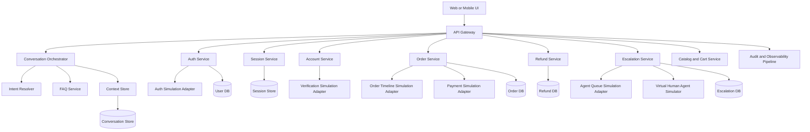
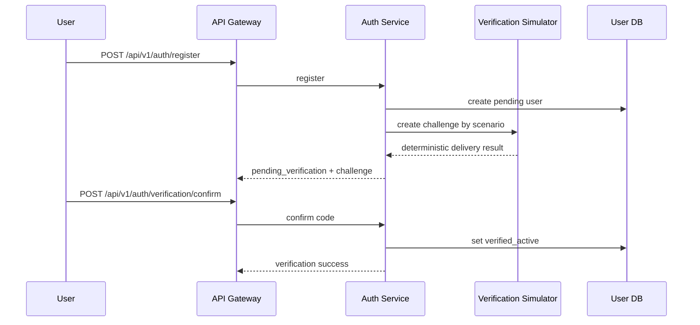
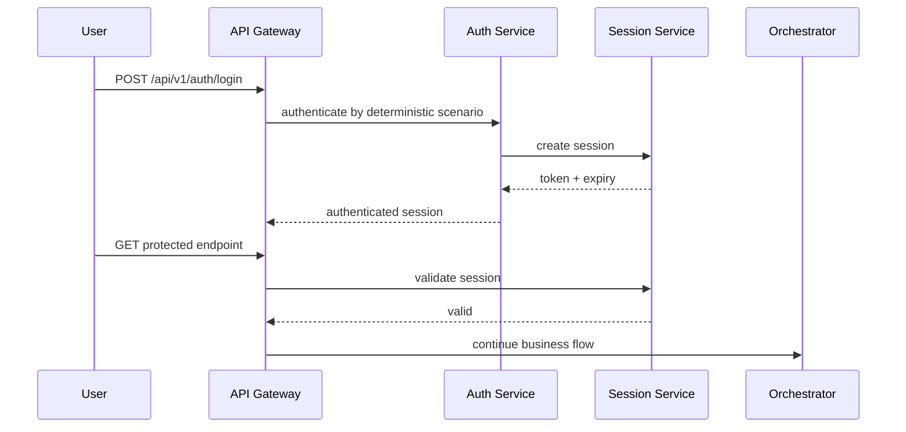
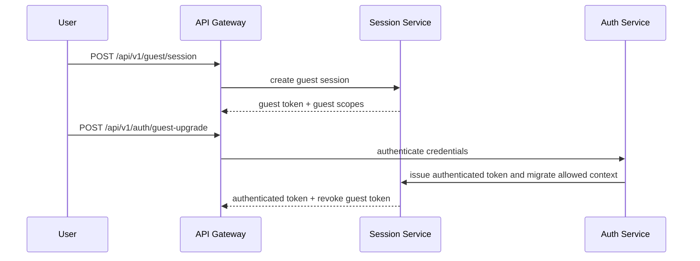
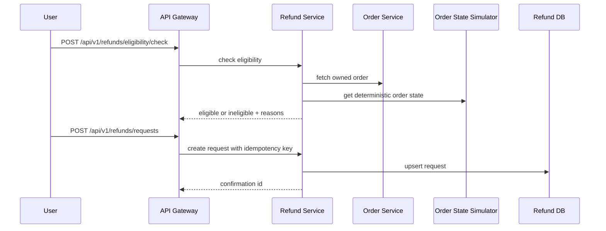
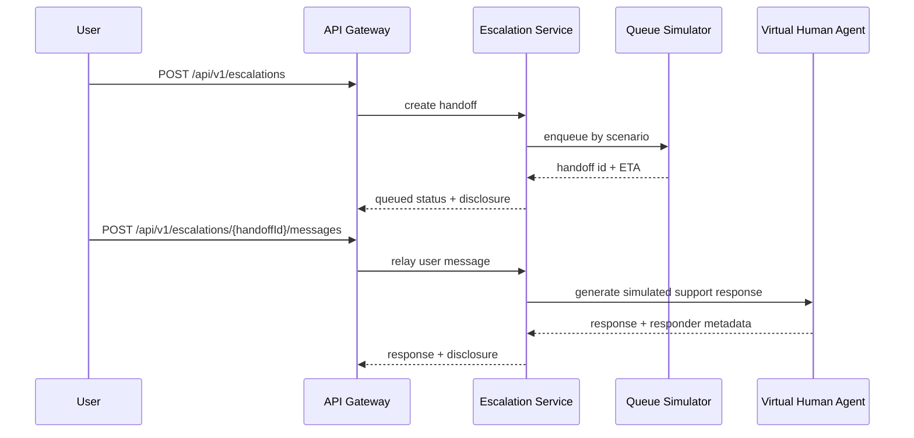
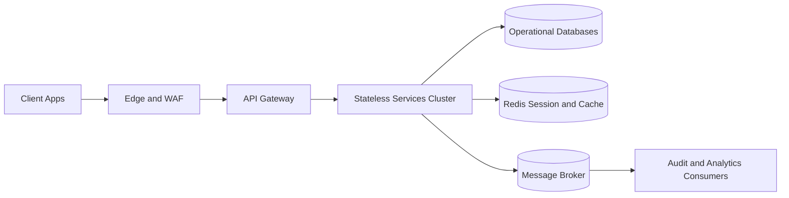

# MVP System Architecture: Smart Food Ordering Platform

## 1. Purpose
Define the end-to-end architecture for MVP customer support capabilities across:
- Intent understanding and FAQ resolution
- Secure account and order retrieval
- Guided refund eligibility and request intake
- Human escalation and handoff
- Guest mode session and guest-to-authenticated upgrade
- User registration and verification
- User login and session management
- Order placement UI

This architecture is simulation-first and deterministic where specified by feature requirements.

## 2. Scope
In scope:
- API-first backend architecture for all feature endpoints
- Session-based authentication and authorization
- Guest session capability with restricted scopes
- Simulation adapters for auth, verification, order lifecycle, payment, and agent queue
- Auditability, observability, and compliance guardrails

Out of scope:
- Live external identity providers
- Live restaurant, driver, payment, and helpdesk integrations
- Real card data processing

## 3. Design Principles
- Deterministic simulation for MVP repeatability in testing
- Zero trust between services with explicit auth and authorization checks
- Clear separation between orchestration logic and simulation adapters
- Idempotency for side-effecting operations
- Privacy by design (masking, minimization, redaction)
- Event-driven observability and audit trails

## 4. Logical Architecture

## 5. Runtime Responsibilities
- API Gateway:
  - Routing, request ID injection, rate limiting, auth token forwarding
- Conversation Orchestrator:
  - Directs user messages to intent, FAQ, retrieval, refund, or escalation flow
- Auth Service:
  - Login, lockout policy, account-state checks, deterministic auth outcomes
- Session Service:
  - Session create, validate, revoke, expiry enforcement
- Account Service:
  - Account profile summary and verification-state gating
- Order Service:
  - Order retrieval and placement orchestration in simulation mode
- Refund Service:
  - Eligibility evaluation and idempotent request creation
- Escalation Service:
  - Handoff creation, queue status, simulated human-agent messaging

## 6. Data Architecture
### 6.1 Primary Stores
- User DB:
  - users, credentials hash, account status, verification state, lockout metadata
- Session Store:
  - session id, principal type (guest or user), user id nullable, issued at, expires at, revoked at, scopes
- Conversation Store:
  - message log, summary, intent trace, confidence trace
- Order DB:
  - cart snapshots, order records, synthetic timeline events, state transitions
- Refund DB:
  - eligibility decisions, request records, idempotency keys
- Escalation DB:
  - handoff tickets, queue status history, responder metadata

### 6.2 Shared Data Contracts
- Correlation fields on all writes:
  - requestId, sessionId, userId, timestamp, featureName
- Security labels:
  - pii, masked, internal-only, public-safe

## 7. Security and Access Model
- Authentication:
  - Bearer access token validated at gateway and session service
  - Guest session token allowed for public-scope endpoints only
- Authorization:
  - Resource ownership check for every order/refund/escalation read or write
  - Guest principal cannot access account, order history, refund submission, or protected user profile endpoints
- Session Controls:
  - Short-lived access token, revocable session id, forced re-auth on expiry
  - Guest upgrade issues new authenticated token and invalidates prior guest token
- Brute-force Protections:
  - Failed-attempt counters and temporary lockout windows
- Data Protection:
  - No PAN, CVV, expiry accepted at API boundary
  - Redaction of secrets before logs and escalation payloads

## 8. Deterministic Simulation Model
Simulation adapters consume scenario identifiers so outcomes are repeatable.

Determinism key format:
- simulationKey = hash(feature + scenarioId + userId + primaryResourceId)

Deterministic domains:
- Authentication outcomes
- Verification code delivery outcome
- Payment authorization outcome
- Order timeline progression
- Escalation queue ETA and human-agent response style

## 9. Request Flows
### 9.1 Registration and Verification

### 9.2 Login and Protected Action

### 9.3 Guest Session and Upgrade

### 9.4 Refund Intake

### 9.5 Escalation and Handoff

## 10. Deployment Architecture

Deployment notes:
- Stateless services are horizontally scalable behind the gateway
- Session store and idempotency cache run in Redis-compatible storage
- Message broker carries audit events and async notifications

## 11. Cross-Cutting Concerns
- Idempotency:
  - Required for order create, refund request create, escalation create
- Observability:
  - Metrics: latency, error rate, confidence distribution, fallback rate, lockout rate
  - Logs: structured JSON with redacted sensitive values
  - Traces: end-to-end spans with requestId propagation
- Reliability:
  - Circuit breakers for simulator adapters
  - Timeouts and retry policy with bounded backoff
  - Graceful fallback to escalation for unrecoverable downstream failures

## 12. NFR Mapping
- Performance:
  - Keep FAQ response path in-memory cache first, fallback to knowledge retrieval
- Security:
  - Strict schema validation and allowlist input parsing
- Privacy:
  - Masked account fields only in retrieval responses
- Availability:
  - Multi-instance services and health-based load balancing

## 13. MVP Endpoint Domains by Service
- Auth Service:
  - /api/v1/auth/register
  - /api/v1/auth/verification/challenge
  - /api/v1/auth/verification/confirm
  - /api/v1/auth/verification/resend
  - /api/v1/guest/session
  - /api/v1/auth/login
  - /api/v1/auth/guest-upgrade
  - /api/v1/auth/logout
  - /api/v1/auth/session/validate
  - /api/v1/auth/account-state/{userId}
- Conversation and FAQ:
  - /api/v1/intent/resolve
  - /api/v1/faq/search
  - /api/v1/conversations/{sessionId}/context
  - /api/v1/fallback/escalation-check
- Account and Orders:
  - /api/v1/auth/session
  - /api/v1/account/me
  - /api/v1/orders/{orderId}
  - /api/v1/orders/{orderId}/timeline-sim
  - /api/v1/orders/{orderId}/state-sim
  - /api/v1/orders/{orderId}/lifecycle-sim
- Catalog, Cart, Checkout:
  - /api/v1/catalog/items
  - /api/v1/cart/items
  - /api/v1/cart/items/{itemId}
  - /api/v1/checkout/validate
  - /api/v1/orders
  - /api/v1/payments/authorize-sim
- Refunds:
  - /api/v1/refunds/eligibility/check
  - /api/v1/refunds/requests
  - /api/v1/refunds/requests/{refundRequestId}
- Escalation:
  - /api/v1/escalations
  - /api/v1/escalations/{handoffId}
  - /api/v1/escalations/{handoffId}/messages
  - /api/v1/escalations/{handoffId}/notify

## 14. Suggested Next Design Artifacts
- C4 Context and Container diagrams
- OpenAPI contract file per service
- Event catalog for audit and integration events
- Threat model (STRIDE) for auth, session, and escalation flows
